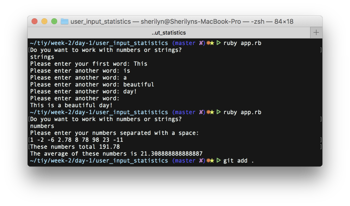

# User Input Statistics

## First Ruby Program designed to take repeated input from the user and generate statistics on those inputs.

* This is a command line program that asks the user to enter any number of  numbers, it then gives the user
  * the total of all the numbers
  * the average of all the numbers

* It works with negative numbers and floats as well

* Functionality added so the program accepts strings as well as numbers

